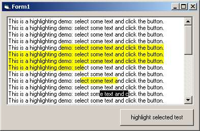



## RichTextBox Highlighting using API \(fast & simple\) \- change text background color

### Description

this is just a quick hack to show how highlighting text in a richtextbox can be achieved using api (fast and easy). i hope it's new and interesting and relieving to some of you ("ahhh, just so easy!"). this came to me after i saw "Bobo RTF tricks" http://www.planetsourcecode.com/vb/scripts/ShowCode.asp?txtCodeId=40401&lngWId=1 and it seemed by far too complicated to me. as i'm into delphi right now, i know about the CHARFORMAT2 capabilities and that it is by far easier to achieve highlighting if you know how. searched the web for it but found no easy solution (one in chinese or so but partly wrong). vbaccelerator has a big rtf control from which i finally ripped the sources. finally found more on VB & rtf with CHARFORMAT2 on psc: http://www.planetsourcecode.com/vb/scripts/ShowCode.asp?txtCodeId=38434&lngWId=1 (but no screenshot, not really sphisticated, take vbaccelerator code to see what's possible). sorry, no more time, have a nice day, buggy!
 
### More Info
 

             |
---                |---
**Submitted On**   |2003-02-25 06:49:04
**By**             |[buggy](https://github.com/Planet-Source-Code/PSCIndex/blob/master/ByAuthor/buggy.md)
**Level**          |Beginner
**User Rating**    |4.9 (34 globes from 7 users)
**Compatibility**  |VB 6\.0
**Category**       |[VB function enhancement](https://github.com/Planet-Source-Code/PSCIndex/blob/master/ByCategory/vb-function-enhancement__1-25.md)
**World**          |[Visual Basic](https://github.com/Planet-Source-Code/PSCIndex/blob/master/ByWorld/visual-basic.md)
**Archive File**   |[RichTextBo1550182252003\.zip](https://github.com/Planet-Source-Code/buggy-richtextbox-highlighting-using-api-fast-simple-change-text-background-color__1-43509/archive/master.zip)

